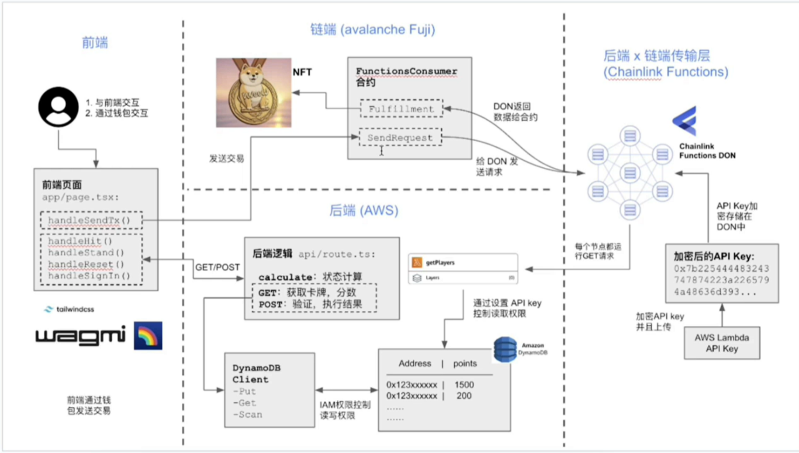
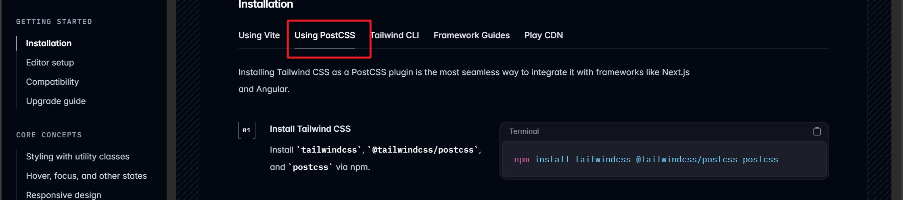

前端页面

创建项目：
pnpm create wagmi
选择react 和next
cd wagmi-projectimg/
安装依赖
pnpm install
安装wagmi官方需要的包
pnpm add @wagmi/core @wagmi/connectors viem@2.x

在package.json中的scripts配置， 目的是跑项目
pnpm run dev

安装tailwindcss,用于写CSS，
查看官方文档：https://tailwindcss.com/docs/installation/using-vite

pnpm add  tailwindcss @tailwindcss/postcss postcss
（注意，这个项目使用pnpm安装包，不要和npm混用，否则会报错）

(按照官方文档操作即可)创建配置文件：postcss.config.mjs
增加内容：
export default {
  plugins: {
    "@tailwindcss/postcss": {},
  }
}

在CSS文件中添加：@import "tailwindcss";

扑克牌花色：https://www.piliapp.com/emoji/list/playing-cards/